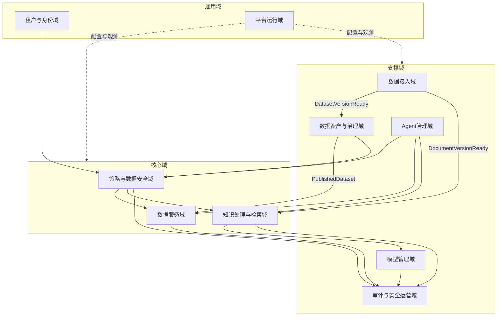
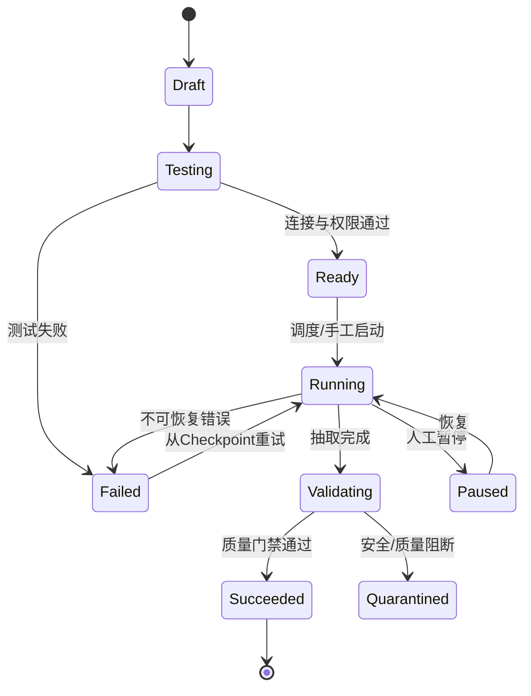
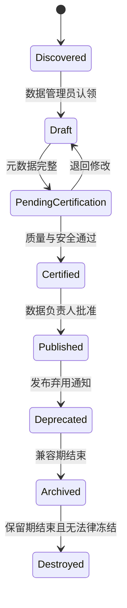
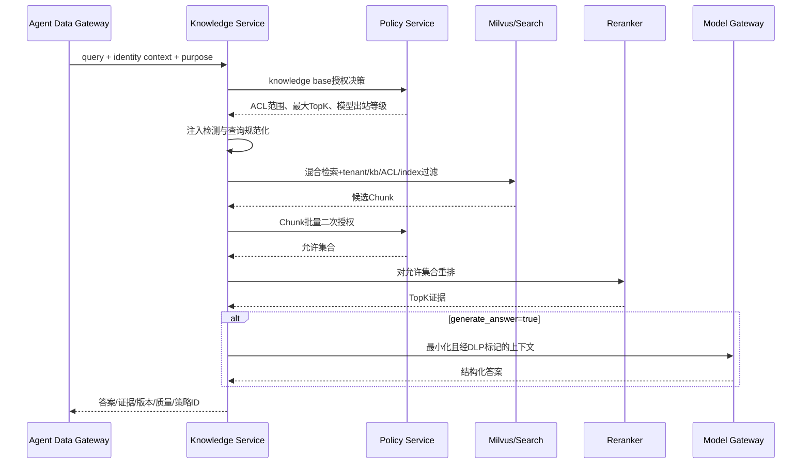
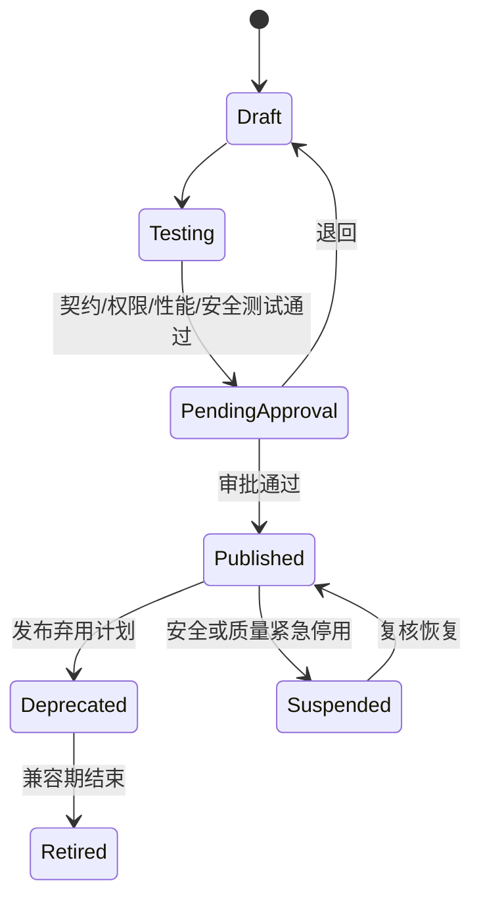
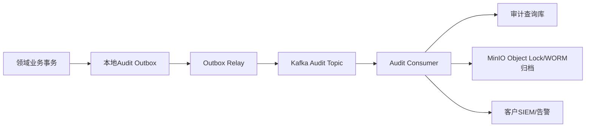
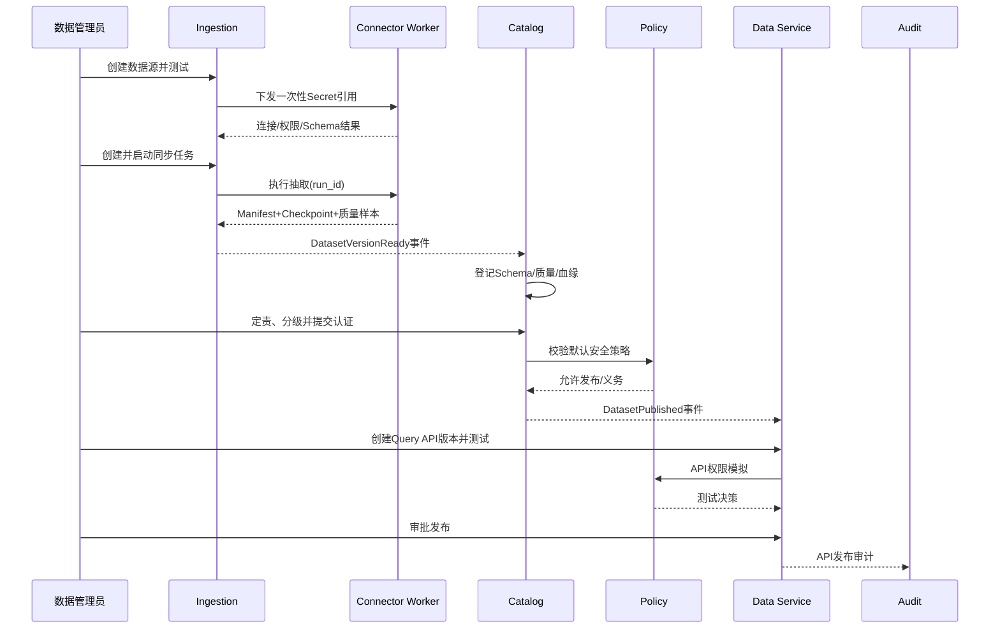
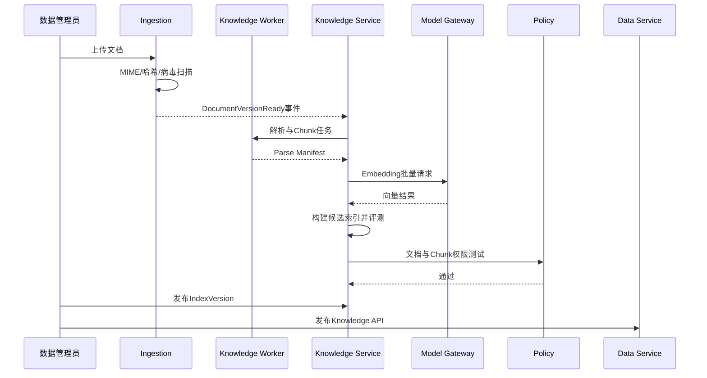
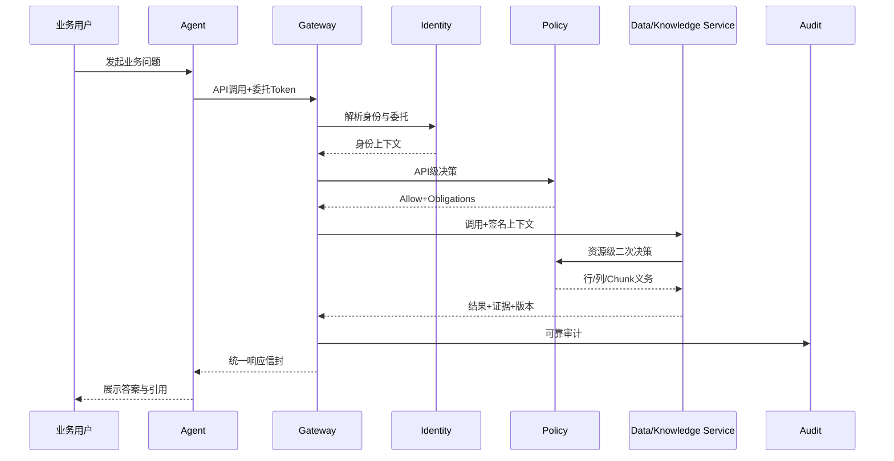

# Agent Data OS V1.0 领域模块与服务边界详细设计

> 产品：Agent Data OS（Enterprise Agent Data Operating System）  
> 文档版本：V1.0-DESIGN-1.0  
> 文档状态：详细设计评审基线  
> 上游文档：[Agent_Data_OS_PRD_SRS.md](./Agent_Data_OS_PRD_SRS.md)  
> 目标读者：产品经理、领域架构师、研发负责人、安全负责人、测试负责人、DevOps与交付团队  
> 设计原则：安全默认拒绝、Agent不直连数据源、数据所有权唯一、同步接口最小化、事件可追踪、部署边界与代码边界解耦

## 1. 文档目标与设计结论

### 1.1 文档目标

本文将V1.0 PRD转化为可进入接口设计、数据库设计、任务拆分和研发排期的领域与服务边界方案，解决以下问题：

1. 平台包含哪些业务领域，每个领域拥有什么数据和规则。
2. 哪些能力必须独立为服务，哪些能力可以在V1.0合并部署。
3. 服务之间通过什么同步接口和异步事件协作。
4. 哪些流程需要强一致，哪些流程允许最终一致。
5. 身份、权限、租户、审计和敏感数据控制如何贯穿所有服务。
6. 如何避免把V1.0建设成一组相互直连、共享数据库的功能模块。

### 1.2 V1.0冻结范围

| 范围 | V1.0结论 | 明确不做 |
|---|---|---|
| 部署 | 企业私有化、专属云优先；保留tenant_id | 共享型公有SaaS规模化运营 |
| 数据接入 | MySQL、PostgreSQL、Oracle批量/增量；PDF、Word、Excel、图片 | 通用CDC平台、IoT实时流、跨云联邦查询 |
| 结构化服务 | 批量同步到平台服务区，经发布的Query API | Agent自由SQL、直连生产数据库、写回业务系统 |
| 知识服务 | 文档解析、Chunk、Embedding、混合检索、引用 | 通用知识图谱、复杂推理、自动事实写回 |
| Agent | Agent注册、工具授权、短期调用凭证、固定主管/专业Agent样例 | 可视化通用Agent编排器、动态无限转委托 |
| 模型 | DeepSeek适配、统一模型网关、Token/成本/安全控制 | 通用模型训练、微调平台、复杂多模型市场 |
| API | Query API、Knowledge API | Insight API、Graph API生产实现 |
| 安全 | RBAC+基础ABAC、动态脱敏、DLP、审计、租户隔离 | 以模型判断代替确定性权限策略 |

### 1.3 顶层设计结论

- 采用领域驱动的模块化架构，V1.0代码可使用单仓库，但禁止跨领域直接读写业务表。
- 逻辑上划分九个领域；物理上建议部署八类应用与六类基础设施。
- 在线Agent调用链与离线数据处理链分离，Airflow不得进入在线请求链路。
- 每类业务数据只有一个权威写入服务；其他服务通过API、只读投影或事件获得数据。
- 审计写入使用本地Outbox与Kafka，防止业务提交成功而审计事件丢失。
- 权限决策与权限执行分离：Policy Service负责决策，Gateway/Query/Knowledge/Model负责执行义务。
- 数据版本、索引版本、策略版本、Agent版本和API版本必须同时进入调用审计。

## 2. 领域全景与限界上下文

### 2.1 领域地图



### 2.2 领域清单

| 领域 | 类型 | 业务职责 | 核心聚合/对象 | 权威数据所有者 |
|---|---|---|---|---|
| 租户与身份域 | 通用域 | 租户、组织、用户、服务主体、登录身份映射 | Tenant、User、ServicePrincipal、CredentialRef | Identity Service |
| 策略与数据安全域 | 核心域 | RBAC、ABAC、用途、脱敏、授权审批、策略决策 | Role、Permission、Policy、Grant、Approval | Policy Service |
| 数据接入域 | 支撑域 | 连接器、数据源、同步任务、文件接入、隔离 | DataSource、Connector、SyncJob、IngestionRun | Ingestion Service |
| 数据资产与治理域 | 支撑域 | 目录、数据集、Schema、分级、责任、质量、血缘、生命周期 | Dataset、DatasetVersion、QualityRule、LineageEdge | Catalog Service |
| 知识处理与检索域 | 核心域 | 文档、解析、Chunk、Embedding、索引、检索和引用 | KnowledgeBase、Document、Chunk、IndexVersion | Knowledge Service |
| 数据服务域 | 核心域 | Query API定义、发布、执行、限流、返回契约 | DataAPI、APIVersion、QueryTemplate、APIRelease | Data Service |
| Agent管理域 | 支撑域 | Agent注册、版本、工具绑定、预算和运行状态 | Agent、AgentVersion、ToolBinding、Delegation | Agent Service |
| 模型管理域 | 支撑域 | Provider、模型配置、路由、调用、Token和成本 | ModelProvider、ModelDeployment、Route、Usage | Model Gateway |
| 审计与安全运营域 | 支撑域 | 不可篡改审计、安全事件、告警、追踪与导出 | AuditEvent、SecurityEvent、Alert、EvidencePackage | Audit Service |
| 平台运行域 | 通用域 | 配置、许可证、作业调度、健康、指标、通知 | RuntimeConfig、License、Notification | Platform Service |

### 2.3 上下文关系

| 上游上下文 | 下游上下文 | 关系模式 | 约束 |
|---|---|---|---|
| 租户与身份 | 所有领域 | Published Language | 仅通过统一身份上下文传递tenant、subject、attributes，不复制密码 |
| 策略与安全 | Gateway及数据执行服务 | Customer/Supplier | 策略结果是权威决策；执行服务必须落实obligations |
| 数据接入 | 数据资产 | Event/ACL | 接入只报告技术发现和数据版本，不决定资产是否发布 |
| 数据资产 | 数据服务 | Published Language | API只能绑定已认证、已发布的数据集版本 |
| 数据接入 | 知识 | Event/ACL | 文档安全扫描通过后才可触发知识处理 |
| 知识 | 数据服务 | Open Host Service | Knowledge API通过稳定检索接口调用，不直读Milvus |
| Agent管理 | 数据服务 | Conformist | Agent使用Data API公开契约，不感知底层表和索引 |
| 模型管理 | 知识 | Open Host Service | 知识服务通过模型网关调用Embedding/生成模型 |
| 所有领域 | 审计 | Event | 审计只消费事件，不反向控制业务事务；安全处置命令除外 |

## 3. 逻辑服务与部署边界

### 3.1 逻辑服务清单

| 服务 | 核心职责 | 明确不负责 | 独立扩容依据 |
|---|---|---|---|
| Identity Service | 租户、用户、组织、服务主体、身份映射、Token交换 | 不保存外部IdP密码；不做数据授权决策 | 登录、Token交换量 |
| Policy Service | 角色、权限、授权、ABAC决策、脱敏义务、审批 | 不直接查询业务数据；不执行SQL过滤 | 授权请求QPS、策略数量 |
| Ingestion Service | 数据源、连接器、任务编排、运行状态、Checkpoint | 不承担在线Agent查询；不决定资产业务口径 | 数据源和同步任务数 |
| Catalog Service | 数据目录、Schema、标签、质量、血缘、发布状态 | 不保存大规模业务数据；不执行Agent查询 | 资产数量、搜索量 |
| Knowledge Service | 文档、解析任务、索引、检索、引用、权限复核 | 不直接调用外部模型；不管理Agent身份 | 文档处理吞吐、检索QPS |
| Data Service | Data API管理、Query模板、发布、查询执行、结果契约 | 不开放自由SQL；不管理源连接凭证 | Query QPS、并发查询数 |
| Agent Service | Agent/版本/工具绑定、权限申请、预算、停用 | 不运行通用Agent业务逻辑；不保存业务会话正文 | Agent数量、管理调用量 |
| Model Gateway | 模型注册、路由、DeepSeek调用、DLP、Token和成本 | 不决定业务数据权限；不拥有知识库 | 模型QPS、Token吞吐 |
| Audit Service | 审计接收、校验、存储、查询、签名归档、安全事件 | 不允许普通服务修改历史事件 | 事件吞吐、保留量 |
| Platform Service | 配置、许可证、通知、健康检查、运维任务 | 不承载核心数据业务规则 | 租户规模、通知量 |
| Agent Data Gateway | 统一入口、鉴权、策略协调、限流、追踪、响应治理 | 不保存领域数据；不直接拼接SQL或访问向量库 | Agent API QPS |
| Worker Pool | 数据抽取、文件解析、OCR、质量计算、Embedding | 不提供公开在线API；不持有长期明文凭证 | CPU/GPU/IO任务队列 |

### 3.2 V1.0物理部署建议

逻辑服务不等于独立进程。V1.0建议以下部署单元：

| 部署单元 | 包含逻辑模块 | 原因 |
|---|---|---|
| `control-api` | Identity、Policy管理面、Catalog、Agent、Platform | 管理类负载相近；通过模块边界保持未来可拆分性 |
| `agent-data-gateway` | Agent入口、认证协调、限流、策略执行协调 | 安全边界与外部流量入口，需要独立发布扩容 |
| `query-service` | Data API运行面、Query执行器 | 数据库连接池和查询负载独立控制 |
| `knowledge-service` | Knowledge管理面、在线检索 | 向量检索负载独立；与批处理分离 |
| `model-gateway` | 模型路由、调用、DLP、用量 | 统一控制所有外部模型出站 |
| `ingestion-api` | 数据源、同步任务、文件任务编排 | 负责状态与命令，不执行重任务 |
| `worker` | Connector、Parser、OCR、Quality、Embedding | 按任务类型拆队列和资源池 |
| `audit-service` | 审计消费、查询、安全事件 | 高可靠、追加写，与业务事务解耦 |

### 3.3 禁止的耦合方式

1. 禁止服务跨库直接更新其他领域表。
2. 禁止Agent Data Gateway直接读取PostgreSQL业务表、MinIO对象或Milvus Collection。
3. 禁止Knowledge Service直接使用DeepSeek密钥。
4. 禁止Worker自行决定资产发布、权限或数据生命周期。
5. 禁止业务服务以日志代替审计事件。
6. 禁止将完整用户权限列表长期复制到每个服务；只能使用短期上下文或策略决策缓存。
7. 禁止Airflow DAG直接修改领域数据库状态；必须调用Ingestion Service内部接口或发送命令。

## 4. 统一请求上下文与服务协议

### 4.1 请求上下文

所有同步调用必须传播以下请求头或等价内部上下文：

| 字段 | 必填 | 说明 |
|---|---:|---|
| `X-Tenant-Id` | 是 | 由网关注入，客户端传入值必须覆盖/拒绝 |
| `X-Request-Id` | 是 | 单次API请求ID |
| `traceparent` | 是 | W3C Trace Context |
| `X-Actor-Type` | 是 | USER/AGENT/SERVICE |
| `X-Actor-Id` | 是 | 当前直接调用主体 |
| `X-Delegated-User-Id` | 条件 | Agent代表用户执行时必填 |
| `X-Purpose` | 数据请求必填 | 经注册的业务用途编码 |
| `X-Environment` | 是 | DEV/TEST/PROD |
| `X-Policy-Version` | 内部返回 | 实际使用的策略快照版本 |

业务服务不得信任外部客户端直接提交的租户、角色、部门或分级属性，必须由网关依据已验证Token构造。

### 4.2 同步接口规范

- 外部API：REST/JSON，OpenAPI 3.1，路径版本`/api/v1`。
- 内部API：V1.0统一REST/JSON；高吞吐场景后续可演进gRPC。
- 时间：ISO 8601、UTC传输。
- ID：UUID/ULID字符串，不使用自增ID作为外部标识。
- 幂等：创建任务、发布、重跑、Token交换等命令必须支持`Idempotency-Key`。
- 分页：游标分页优先，默认20，最大200。
- 乐观锁：更新接口携带`version`或`If-Match`。
- 错误：稳定错误码+`request_id`+`trace_id`，不得返回内部堆栈和物理连接信息。

### 4.3 统一事件信封

```json
{
  "event_id": "evt_01J...",
  "event_type": "catalog.dataset.published.v1",
  "event_version": 1,
  "tenant_id": "0c3d...",
  "aggregate_type": "Dataset",
  "aggregate_id": "d52a...",
  "aggregate_version": 7,
  "occurred_at": "2026-08-04T02:10:33Z",
  "producer": "catalog-service",
  "trace_id": "tr_01J...",
  "actor": {
    "type": "USER",
    "id": "8f2b..."
  },
  "data_classification": "INTERNAL",
  "payload": {}
}
```

事件规范：

- Topic按领域划分，例如`ados.catalog.events.v1`，不按单个事件无限创建Topic。
- 事件载荷不得包含文档正文、查询结果、凭证或高敏字段。
- 消费者必须以`event_id`去重；同一聚合按`aggregate_version`处理乱序。
- 生产者使用Transactional Outbox；事件至少一次投递，消费者必须幂等。
- 破坏性事件Schema变更发布新版本；Schema进入Registry并做兼容校验。

## 5. 租户与身份域详细设计

### 5.1 核心职责

- 创建、启用、停用租户并维护数据驻留属性。
- 对接OIDC/SAML身份提供方，维护外部主体到平台用户的映射。
- 管理用户、组织、服务主体和Agent身份凭据引用。
- 执行OAuth2 Token Exchange，为Agent签发短期委托Token。
- 提供统一身份上下文，不提供业务资源授权结论。

### 5.2 核心聚合

```text
Tenant
 ├─ TenantSecurityProfile
 ├─ IdentityProviderConfig
 └─ OrganizationUnit

Principal
 ├─ UserPrincipal
 ├─ AgentPrincipal
 └─ ServicePrincipal

Delegation
 ├─ delegator_user_id
 ├─ delegate_agent_id
 ├─ allowed_scope
 ├─ purpose
 ├─ audience
 ├─ expires_at
 └─ max_calls
```

### 5.3 领域规则

1. `tenant_id`不可变；跨租户迁移必须创建新主体并走数据迁移流程。
2. 停用租户后不得签发新Token，现有Token在60秒内全局失效。
3. 用户被停用后，其委托Token同时失效。
4. Agent主体与Agent业务定义分离；删除Agent版本不直接删除主体审计记录。
5. 委托范围不得大于用户、Agent和API权限交集。
6. 服务凭证仅存Secret引用；私钥和Client Secret不得进入业务数据库。

### 5.4 主要接口

| 接口 | 调用方 | 说明 |
|---|---|---|
| `POST /internal/v1/identity/resolve` | Gateway | 将已验证Token转换为身份上下文 |
| `POST /internal/v1/tokens/exchange` | Gateway/Agent Service | 签发受限委托Token |
| `POST /api/v1/tenants/{id}/users` | 管理控制台 | 创建或邀请用户 |
| `PATCH /api/v1/users/{id}/status` | 企业管理员 | 锁定/停用用户 |
| `POST /api/v1/service-principals/{id}/rotate` | 企业管理员 | 轮换服务凭据 |

### 5.5 领域事件

- `identity.tenant.status_changed.v1`
- `identity.user.status_changed.v1`
- `identity.principal.revoked.v1`
- `identity.delegation.issued.v1`
- `identity.credential.rotated.v1`

`principal.revoked`属于高优先级控制事件，Gateway、Policy、Data、Knowledge和Model服务收到后必须立即清理相关缓存。

## 6. 策略与数据安全域详细设计

### 6.1 核心职责

- 管理角色、权限、资源策略、用途策略和授权有效期。
- 管理访问申请、审批与自动回收。
- 根据主体、资源、动作、用途、环境作出策略决策。
- 返回行过滤、列隐藏、动态脱敏、结果限量、禁止导出等执行义务。
- 支持策略模拟、版本、发布、回滚和紧急拒绝策略。

### 6.2 策略决策模型

```text
DecisionRequest
 ├─ subject: tenant/user/agent/service/attributes
 ├─ resource: type/id/domain/classification/owner
 ├─ action: query/retrieve/manage/publish/export
 ├─ context: purpose/environment/time/network/risk
 └─ delegation: user-agent-audience-scope-expiry

DecisionResult
 ├─ effect: ALLOW | DENY | ALLOW_WITH_OBLIGATIONS
 ├─ decision_id
 ├─ policy_version
 ├─ row_filters
 ├─ field_masks
 ├─ max_rows/max_tokens/rate_limit
 ├─ model_egress_level
 └─ reason_codes
```

### 6.3 决策优先级

1. 租户停用、主体吊销和紧急封禁。
2. 显式DENY策略。
3. 数据地域、环境和敏感等级硬约束。
4. Agent自身Scope与用户委托Scope交集。
5. RBAC允许项。
6. ABAC条件。
7. 执行义务合并，取最严格值。

任何策略计算异常均返回DENY，不允许失败放行。

### 6.4 主要接口

| 接口 | 调用方 | SLA | 说明 |
|---|---|---:|---|
| `POST /internal/v1/policy/decisions` | Gateway/服务PEP | P95≤50ms | 单资源决策 |
| `POST /internal/v1/policy/batch-decisions` | Catalog/Knowledge | P95≤100ms | 搜索结果批量裁剪 |
| `POST /api/v1/access-requests` | 用户/Agent开发者 | — | 发起授权申请 |
| `POST /api/v1/access-requests/{id}/approve` | 数据负责人/安全管理员 | — | 审批 |
| `POST /api/v1/policies/simulate` | 安全管理员 | — | 上线前模拟，不改变生产策略 |

### 6.5 决策缓存

- 只缓存允许结果，默认TTL≤60秒；DENY可短期缓存≤10秒防止攻击放大。
- 缓存键包含tenant、主体、代理用户、Agent版本、资源、动作、用途、环境和策略版本。
- 紧急吊销通过Kafka控制事件+本地订阅实现主动失效。
- Query/Knowledge服务不得缓存脱离策略决策上下文的数据结果。

### 6.6 领域事件

- `policy.version.published.v1`
- `policy.grant.created.v1`
- `policy.grant.revoked.v1`
- `policy.access_request.decided.v1`
- `policy.emergency_deny.activated.v1`

## 7. 数据接入域详细设计

### 7.1 聚合边界

| 聚合 | 包含对象 | 不变量 |
|---|---|---|
| DataSource | 类型、端点密文、Secret引用、网络区、Owner、状态 | Secret不进入配置明文；租户内名称唯一 |
| ConnectorDefinition | 连接器类型、版本、参数Schema、能力、兼容矩阵 | 已运行任务固定连接器版本 |
| SyncJob | 数据选择、同步策略、映射、调度、质量门禁 | ACTIVE任务必须绑定已测试DataSource |
| IngestionRun | 批次、Checkpoint、统计、错误、输出版本 | 状态单向推进；重试不重复提交同一版本 |
| FileIngestion | 文件哈希、扫描、解析请求、来源ACL | 未通过安全扫描不得进入知识处理 |

### 7.2 同步任务状态机



### 7.3 数据库连接器边界

连接器只允许：

- 读取数据库元数据、白名单表/视图和批准字段。
- 执行平台生成的参数化只读查询。
- 维护增量游标、主键水位或更新时间水位。
- 返回结构化错误码、统计和Checkpoint。

连接器禁止：

- 执行DDL/DML、存储过程和用户自由SQL。
- 自动扩大源端权限或扫描未选择Schema。
- 将源数据库凭证写入任务参数、日志、Airflow XCom或事件。
- 未经限速直接对源系统进行大表全量扫描。

### 7.4 文件处理边界

```text
Upload Session
 → MIME/扩展名一致性
 → SHA-256去重
 → 病毒扫描
 → 文件安全策略
 → MinIO Raw Bucket
 → DocumentVersionReady事件
```

文件解析属于Knowledge Worker职责；Ingestion Service只负责安全接收、版本和任务编排，不解释文档语义。

### 7.5 主要接口

| 接口 | 说明 |
|---|---|
| `POST /api/v1/data-sources` | 创建数据源，配置使用Secret引用 |
| `POST /api/v1/data-sources/{id}/test` | 异步连接与权限测试 |
| `POST /api/v1/data-sources/{id}/discover` | 异步发现Schema |
| `POST /api/v1/sync-jobs` | 创建同步任务 |
| `POST /api/v1/sync-jobs/{id}/runs` | 手工启动，支持幂等键 |
| `POST /api/v1/sync-runs/{id}/retry` | 从Checkpoint重试 |
| `POST /api/v1/files/uploads` | 创建分片上传会话 |
| `POST /internal/v1/ingestion/runs/{id}/callbacks` | Worker报告进度与结果 |

### 7.6 核心事件

- `ingestion.datasource.tested.v1`
- `ingestion.schema.discovered.v1`
- `ingestion.run.started.v1`
- `ingestion.dataset_version.ready.v1`
- `ingestion.document_version.ready.v1`
- `ingestion.run.quarantined.v1`
- `ingestion.run.failed.v1`

### 7.7 幂等与恢复

- `SyncJob + schedule_time`形成逻辑运行唯一键。
- 输出对象路径包含tenant、job、run、partition和content_hash。
- Worker成功写入数据后先生成Manifest，再回调状态；Catalog只接受完整Manifest。
- 回调超时可重试；Ingestion Service根据`run_id + result_hash`去重。
- 任务取消只阻止新分片，已完成不可变分片由生命周期任务回收。

## 8. 数据资产与治理域详细设计

### 8.1 核心职责

- 将技术发现转换为可治理资产。
- 管理业务定义、Schema版本、标签、分级、Owner/Steward和生命周期。
- 管理质量规则、运行结果、质量分和发布门禁。
- 管理字段级与任务级血缘。
- 为Data API和Knowledge API提供权威资源元数据。

### 8.2 资产状态机



### 8.3 发布门禁

数据集发布必须满足：

- Owner、Steward、业务域、描述、分级和更新SLA齐全。
- Schema已固定版本，主键/时间字段等基础语义已确认。
- P0质量规则全部通过；P1失败有负责人豁免和期限。
- 敏感字段已确认并绑定默认脱敏策略。
- 上游来源和同步任务血缘完整。
- 数据负责人审批完成。

### 8.4 数据所有权

Catalog拥有资产定义与状态，但不拥有：

- Ingestion的连接配置、Checkpoint和运行日志。
- Serving数据库中的业务数据行。
- Knowledge的文档解析、Chunk和向量索引。
- Policy的授权关系。

### 8.5 主要接口

| 接口 | 调用方 | 说明 |
|---|---|---|
| `POST /internal/v1/catalog/discoveries` | Ingestion | 登记发现的数据对象和Schema |
| `GET /api/v1/assets` | 控制台 | 权限裁剪后的目录搜索 |
| `GET /api/v1/datasets/{id}` | 控制台/Data Service | 资产详情与当前发布版本 |
| `POST /api/v1/datasets/{id}/certify` | 数据管理员 | 提交认证 |
| `POST /api/v1/datasets/{id}/publish` | 数据负责人 | 发布数据集 |
| `POST /api/v1/quality-rules` | 数据管理员 | 创建质量规则 |
| `GET /api/v1/lineage` | 控制台/审计 | 按节点查询上下游 |

### 8.6 核心事件

- `catalog.dataset.discovered.v1`
- `catalog.dataset.version_created.v1`
- `catalog.dataset.certified.v1`
- `catalog.dataset.published.v1`
- `catalog.dataset.deprecated.v1`
- `catalog.classification.changed.v1`
- `catalog.quality.blocked.v1`

数据分级提高时，Policy、Data、Knowledge和Model服务必须失效相关缓存并采用更严格策略。

## 9. 知识处理与检索域详细设计

### 9.1 子模块边界

| 子模块 | 职责 | 存储 |
|---|---|---|
| Knowledge Base Management | 知识库、成员、检索配置、发布状态 | PostgreSQL |
| Document Registry | 文档版本、ACL、解析状态、有效期 | PostgreSQL/MinIO引用 |
| Parse Pipeline | 文本、版面、表格、OCR及解析产物 | Worker + MinIO |
| Chunk Pipeline | 切分、位置、哈希、敏感标签、ACL Token | Worker + PostgreSQL/MinIO |
| Embedding Pipeline | 模型选择、批次、向量写入、失败重试 | Worker + Milvus |
| Index Management | 索引版本构建、验证、切换和回滚 | PostgreSQL + Milvus |
| Retrieval Runtime | 查询安全、混合召回、重排、ACL复核、引用 | Knowledge Service |

### 9.2 核心聚合

```text
KnowledgeBase
 ├─ RetrievalPolicy
 ├─ MemberBinding
 ├─ ActiveIndexVersion
 └─ KnowledgeBaseRelease

Document
 └─ DocumentVersion
     ├─ ParseArtifact
     ├─ Chunk[*]
     ├─ DocumentACL
     └─ ProcessingRun[*]

IndexVersion
 ├─ embedding_model_version
 ├─ parser/chunk_strategy_version
 ├─ included_document_versions
 ├─ build_manifest
 └─ evaluation_result
```

### 9.3 索引发布模型

索引采用蓝绿版本：

1. 新文档版本写入`BUILDING`索引，不影响生产检索。
2. 完成数量校验、ACL测试、评测集和抽样引用校验。
3. 发布事务仅更新PostgreSQL中的`active_index_version`指针。
4. 在线检索读取指针并访问相应Milvus Collection/Partition。
5. 旧索引保留回滚窗口，之后由生命周期任务清理。

### 9.4 检索运行时步骤



### 9.5 权限变化处理

- 文档权限以Policy为权威源，Milvus ACL字段仅用于预过滤加速。
- Policy Grant撤销后立即禁止二次鉴权通过，即使索引ACL尚未更新。
- ACL索引更新SLA≤5分钟；超过SLA自动将相关知识库切换为只返回已重新校验内容或临时停用。
- 文档删除先标记`REVOKED`阻断检索，后异步删除向量和对象；审计记录保留。

### 9.6 主要接口

| 接口 | 说明 |
|---|---|
| `POST /api/v1/knowledge-bases` | 创建知识库 |
| `POST /api/v1/knowledge-bases/{id}/documents` | 关联已安全接入的文档版本 |
| `POST /api/v1/knowledge-bases/{id}/index-runs` | 构建新索引版本 |
| `POST /api/v1/index-versions/{id}/publish` | 发布索引 |
| `POST /internal/v1/knowledge/retrieve` | Data Service/Gateway调用的检索接口 |
| `POST /api/v1/knowledge-bases/{id}/test-retrieval` | 管理员检索测试 |
| `DELETE /api/v1/documents/{id}` | 撤销文档并触发清理 |

### 9.7 核心事件

- `knowledge.document.registered.v1`
- `knowledge.document.parsed.v1`
- `knowledge.document.quarantined.v1`
- `knowledge.index.built.v1`
- `knowledge.index.published.v1`
- `knowledge.document.revoked.v1`
- `knowledge.retrieval.feedback_received.v1`

## 10. 数据服务域详细设计

### 10.1 核心职责

- 管理Query API与Knowledge API的定义、版本、测试、审批和发布。
- 将Agent的结构化请求转换为受控查询计划。
- 绑定数据资产/知识库、权限策略、SLA、配额和返回Schema。
- 执行字段和行级义务、结果脱敏、质量与新鲜度封装。
- 提供机器可读OpenAPI、JSON Schema和Agent Tool Schema。

### 10.2 Data API聚合

```text
DataAPI
 ├─ type: QUERY | KNOWLEDGE
 ├─ owner
 ├─ business_purpose_allowlist
 ├─ APIVersion[*]
 │   ├─ input_schema
 │   ├─ output_schema
 │   ├─ resource_bindings
 │   ├─ QueryTemplate / RetrievalTemplate
 │   ├─ permission_policy_id
 │   ├─ rate_limit
 │   └─ sla
 └─ APIRelease[*]
     ├─ environment
     ├─ release_status
     ├─ approval_record
     └─ effective_period
```

### 10.3 Query API编译与执行

```text
Agent DSL
 → JSON Schema校验
 → API版本与用途校验
 → Policy决策
 → 字段白名单/过滤操作符校验
 → 合并不可覆盖的行级条件
 → 生成参数化SQL AST
 → 成本预估/超时/扫描量检查
 → 只读连接执行
 → 列脱敏/结果限量
 → 数据版本/质量/新鲜度封装
 → 审计
```

关键规则：

- 行级安全条件由服务端合并，Agent不得传入或覆盖系统条件。
- 查询模板绑定逻辑字段，不在外部契约暴露物理Schema。
- 模板发布时编译并保存指纹；运行时禁止改变FROM/JOIN结构。
- 数据集版本切换前执行API兼容测试；不兼容时保持旧版本并阻断切换。
- 数据结果缓存默认关闭；开启时必须包含主体、用途、策略和数据版本。

### 10.4 Knowledge API边界

Data Service拥有对外API契约、配额和发布状态；Knowledge Service拥有检索算法与索引。Data Service不得绕过Knowledge Service读取Milvus。

### 10.5 API发布状态机



### 10.6 主要接口

| 接口 | 说明 |
|---|---|
| `POST /api/v1/data-apis` | 创建API草稿 |
| `POST /api/v1/data-apis/{id}/versions` | 创建不可变API版本 |
| `POST /api/v1/api-versions/{id}/test` | 契约、安全和性能测试 |
| `POST /api/v1/api-versions/{id}/publish` | 审批后发布 |
| `POST /agent-data/v1/query/{api_code}` | Agent调用Query API |
| `POST /agent-data/v1/knowledge/{api_code}` | Agent调用Knowledge API |
| `POST /api/v1/data-apis/{id}/suspend` | 紧急停用 |

### 10.7 核心事件

- `dataservice.api.version_created.v1`
- `dataservice.api.published.v1`
- `dataservice.api.deprecated.v1`
- `dataservice.api.suspended.v1`
- `dataservice.query.completed.v1`
- `dataservice.query.denied.v1`

完成事件只包含结果行数、延迟、数据版本、质量和摘要哈希，不包含查询结果明文。

## 11. Agent管理域详细设计

### 11.1 核心职责

- 注册Agent及其Owner、用途、风险级别和运行环境。
- 管理不可变Agent版本、Tool绑定、数据API访问申请和预算。
- 管理Agent启停、Kill Switch和短期委托。
- 提供Agent调用统计和自身审计视图。
- 提供V1.0主管Agent/专业Agent参考模板元数据。

### 11.2 Agent与身份的关系

- `Agent`是业务定义，描述用途、Owner和生命周期。
- `AgentVersion`是可部署配置快照。
- `AgentPrincipal`属于Identity域，是调用身份。
- `ToolBinding`声明Agent版本可以请求哪些工具，但不等同于最终数据授权。
- `Grant`属于Policy域，决定特定环境、用途和有效期内的实际访问权。

### 11.3 Agent发布门禁

1. Owner、用途、风险级别、预算和支持联系人完整。
2. 所有工具使用固定版本，不允许`latest`。
3. 数据访问申请已批准且未超范围。
4. Prompt Injection、越权、敏感数据泄露和成本测试通过。
5. 生产服务主体与开发服务主体分离。
6. Kill Switch与告警联系人已配置。

### 11.4 委托Token约束

```json
{
  "sub": "agent_principal_1024",
  "tenant_id": "tenant_001",
  "delegated_user": "user_9001",
  "agent_id": "agent_sales",
  "agent_version": "1.2.0",
  "aud": ["agent-data-gateway"],
  "scope": ["api:receivable.query", "api:sales_policy.retrieve"],
  "purpose": "sales_risk_followup",
  "parent_task_id": "task_01J...",
  "max_calls": 20,
  "exp": 1785810600
}
```

委托Token只包含授权引用和最小声明，不包含用户角色全量列表或数据过滤明文。

### 11.5 主要接口与事件

| 类型 | 名称 | 说明 |
|---|---|---|
| API | `POST /api/v1/agents` | 注册Agent |
| API | `POST /api/v1/agents/{id}/versions` | 创建Agent版本 |
| API | `POST /api/v1/agent-versions/{id}/tool-bindings` | 绑定工具 |
| API | `POST /api/v1/agent-versions/{id}/submit` | 提交发布审批 |
| API | `POST /api/v1/agents/{id}/suspend` | Kill Switch |
| API | `POST /internal/v1/agents/{id}/delegations` | 创建短期委托 |
| Event | `agent.version.published.v1` | Agent版本发布 |
| Event | `agent.status.suspended.v1` | Agent停用，高优先级控制事件 |
| Event | `agent.tool_binding.changed.v1` | 工具绑定变化 |

## 12. 模型管理域详细设计

### 12.1 服务边界

Model Gateway是平台内唯一允许访问DeepSeek API的服务。业务服务只提交结构化模型任务，不传入供应商密钥或供应商特有参数。

### 12.2 模型任务类型

| 任务类型 | 调用方 | 输入 | 输出 | V1.0策略 |
|---|---|---|---|---|
| EMBEDDING | Knowledge Worker | 经DLP处理的Chunk | 向量数组/引用 | 批量、可重试、固定模型版本 |
| RERANK | Knowledge Service | Query+候选片段 | 排序分数 | 可使用本地组件或批准模型 |
| GENERATION | Knowledge Service/Agent | 指令+授权证据 | 结构化答案 | 必须带用途与出站等级 |
| CLASSIFICATION | Ingestion/Knowledge | 文本片段 | 分类标签/置信度 | 不能单独决定最终数据分级 |

### 12.3 模型路由顺序

```text
任务类型
 → 租户允许的Provider
 → 数据分级与出站限制
 → 地域和合规标签
 → 上下文长度与结构化输出能力
 → 预算与配额
 → 延迟/可用性
 → 选定DeepSeek Deployment
```

无满足硬约束的模型时返回`MODEL_POLICY_BLOCKED`，不得自动降级到未经批准模型。

### 12.4 调用安全

- Prompt由系统模板、用户问题和数据上下文分别标记边界。
- 出站前执行DLP；根据策略执行阻断、Tokenization或脱敏。
- 生成结果执行JSON Schema、敏感信息和引用一致性校验。
- 原始Prompt/Response默认不进入普通日志；调试留存需单独授权、加密和短保留期。
- 供应商错误转换为平台稳定错误码，隐藏Provider密钥和网络信息。

### 12.5 主要接口与事件

| 类型 | 名称 | 说明 |
|---|---|---|
| API | `POST /internal/v1/models/invoke` | 统一模型调用 |
| API | `POST /internal/v1/models/embeddings` | 批量Embedding |
| API | `GET /api/v1/model-deployments` | 模型配置列表 |
| API | `GET /api/v1/model-usage` | Token与成本统计 |
| Event | `model.invocation.completed.v1` | 模型调用计量事件 |
| Event | `model.invocation.blocked.v1` | DLP或策略阻断 |
| Event | `model.budget.threshold_reached.v1` | 预算阈值告警 |

## 13. 审计与安全运营域详细设计

### 13.1 审计与业务日志的区别

| 维度 | 业务日志 | 审计事件 |
|---|---|---|
| 目的 | 故障排查、性能分析 | 责任追踪、合规取证 |
| 可修改/删除 | 按日志保留策略滚动 | 追加写、签名/WORM，不允许普通修改 |
| 内容 | 技术状态，不含敏感正文 | 主体、动作、资源、策略、结果摘要 |
| 完整性 | 尽力保证 | 关键事件必须保证，可验证缺口 |
| 权限 | 运维人员 | 独立审计角色、最小权限 |

### 13.2 可靠审计链路



对无本地事务的Gateway调用，必须在向客户端返回成功前确认审计事件已进入可靠本地队列或Kafka；审计通路完全不可用时，敏感数据调用失败关闭。

### 13.3 安全事件状态

`OPEN → TRIAGED → INVESTIGATING → CONTAINED → RESOLVED → CLOSED`。

P0事件可触发自动响应：吊销主体、停用Agent、冻结API、关闭模型出口或隔离知识库。自动响应规则必须版本化并可审计。

### 13.4 主要接口

| 接口 | 说明 |
|---|---|
| `POST /internal/v1/audit/events` | 低吞吐管理事件写入；在线高吞吐优先Kafka |
| `GET /api/v1/audit/events` | 权限裁剪的审计搜索 |
| `GET /api/v1/audit/traces/{trace_id}` | 重建用户—Agent—数据—模型调用链 |
| `POST /api/v1/audit/exports` | 创建签名审计包，需审批 |
| `POST /api/v1/security-events/{id}/contain` | 执行隔离处置 |

## 14. 平台运行域详细设计

### 14.1 职责

- 管理环境级运行配置和Feature Flag。
- 管理平台授权、版本、组件兼容矩阵和升级前检查。
- 汇总健康状态、容量、告警和通知。
- 管理通知渠道，不在通知内容中发送敏感正文。
- 提供私有化安装、备份恢复、诊断包和离线升级能力。

### 14.2 配置分级

| 配置类型 | 示例 | 变更规则 |
|---|---|---|
| 安全基线 | Token TTL、TLS、外部模型开关 | 双人审批、灰度、即时审计 |
| 业务配置 | 默认分页、质量阈值 | Owner审批、版本化 |
| 运行配置 | 线程池、队列并发、超时 | 运维审批、可回滚 |
| Secret | DB密码、DeepSeek Key | 仅Secret Manager，业务配置只保存引用 |
| Feature Flag | 新解析器、缓存策略 | 按租户/环境灰度，带过期时间 |

## 15. Agent Data Gateway详细设计

### 15.1 请求处理管线

```text
TLS/WAF
 → Token验证
 → 身份上下文解析
 → Agent状态与版本检查
 → 用途、Audience、委托检查
 → API目录解析
 → 限流/并发/预算预检
 → Policy决策
 → 下游服务调用
 → obligations执行复核
 → 响应Schema与DLP
 → 审计提交
 → 返回Agent
```

### 15.2 Gateway与领域服务职责划分

| 控制 | Gateway | 下游服务 |
|---|---|---|
| Token认证 | 主责 | 信任工作负载身份与签名上下文 |
| API级授权 | 主责 | 二次校验资源绑定 |
| 行列权限 | 传递决策义务 | Query/Knowledge负责最终执行 |
| 限流 | Agent/API/租户全局限流 | 查询并发和存储资源限额 |
| 脱敏 | 响应兜底DLP | 最接近数据处执行字段脱敏 |
| 审计 | 记录外部调用 | 记录领域执行细节，共用trace_id |
| 重试 | 仅对明确幂等调用 | 下游根据操作语义处理 |

### 15.3 失败策略

- Identity或Policy不可用：所有数据调用失败关闭。
- Audit可靠写入不可用：敏感API失败关闭；低敏API是否降级由租户策略决定。
- Catalog不可用：使用短期已发布API快照，禁止创建/发布变更。
- Query数据源不可用：返回可重试错误，不切换到旧数据，除非API明确允许并标注时效。
- Model不可用：Knowledge API可配置降级为仅返回检索证据。

## 16. 数据存储所有权与Schema边界

### 16.1 数据库划分

V1.0可使用同一PostgreSQL集群降低运维成本，但必须按数据库或Schema隔离：

| Schema/Database | 所有者 | 允许写入方 |
|---|---|---|
| `identity` | Identity模块 | Identity Service |
| `policy` | Policy模块 | Policy Service |
| `ingestion` | Ingestion模块 | Ingestion Service |
| `catalog` | Catalog模块 | Catalog Service |
| `knowledge_meta` | Knowledge模块 | Knowledge Service |
| `data_service` | Data Service | Data Service |
| `agent` | Agent模块 | Agent Service |
| `model` | Model Gateway | Model Gateway |
| `audit` | Audit Service | Audit Consumer |
| `serving_<tenant>` | Query Service数据面 | Ingestion发布器；Query只读 |

每个服务使用独立数据库账号；数据库权限层禁止跨Schema写入。跨域查询通过API或只读投影完成。

### 16.2 MinIO Bucket规划

| Bucket | 内容 | 控制 |
|---|---|---|
| `ados-raw-{tenant}` | 原始文件和结构化批次 | 版本、SSE-KMS、禁止公共访问 |
| `ados-curated-{tenant}` | 标准化Parquet、解析产物 | 仅Worker写、服务只读 |
| `ados-quarantine-{tenant}` | 风险文件/失败批次 | 安全管理员专属访问 |
| `ados-audit-{tenant}` | 审计归档与签名包 | Object Lock/WORM |
| `ados-backup-{tenant}` | 加密备份 | 独立密钥和生命周期 |

### 16.3 Milvus规划

- 私有化单租户仍写入`tenant_id`标量字段。
- Collection按Embedding维度/模型大版本划分，知识库使用Partition或逻辑过滤。
- 所有检索条件由Knowledge Service注入`tenant_id`、`kb_id`、`index_version`和ACL Token。
- 禁止对外暴露Milvus地址、Collection名称和凭证。

## 17. 服务依赖矩阵

图例：S=同步调用，E=事件订阅，D=仅依赖数据契约，—=无依赖。

| 调用方\被调用方 | Identity | Policy | Ingestion | Catalog | Knowledge | Data | Agent | Model | Audit |
|---|---:|---:|---:|---:|---:|---:|---:|---:|---:|
| Gateway | S | S | — | D | S | S | S | — | S/E |
| Identity | — | — | — | — | — | — | — | — | E |
| Policy | S/D | — | — | S/D | — | — | S/D | — | E |
| Ingestion | S/D | S | — | S/E | — | — | — | — | E |
| Catalog | S/D | S | E | — | — | — | — | — | E |
| Knowledge | S/D | S | E | S | — | — | — | S | E |
| Data | S/D | S | — | S | S | — | S/D | — | E |
| Agent | S | S | — | — | — | S/D | — | — | E |
| Model | S/D | S | — | — | — | — | — | — | E |
| Audit | S/D | S | — | — | — | — | — | — | — |

设计要求：

- 在线核心链路最多允许Gateway→Policy→Data/Knowledge→Model四级同步调用。
- 严禁形成同步环路。
- 资产、权限、状态和版本变化优先通过事件传播。
- 各服务对外接口设置超时、熔断和并发上限，不做无界重试。

## 18. 关键端到端流程

### 18.1 数据库数据集接入并发布Query API



### 18.2 文档接入并发布Knowledge API



### 18.3 Agent在线调用



## 19. 一致性与事务设计

### 19.1 一致性分类

| 场景 | 一致性要求 | 方案 |
|---|---|---|
| 用户/Agent紧急吊销 | 近实时强制生效 | 控制事件+短TTL+每次敏感调用在线决策 |
| 策略发布 | 策略版本强一致 | Policy本地事务；发布后事件失效缓存 |
| 同步批次与数据版本 | 版本原子可见 | Manifest完成后切换active_version |
| 索引构建与发布 | 版本原子可见 | 蓝绿索引+指针切换 |
| API发布 | 配置与审批强一致 | Data Service本地事务+Outbox |
| 资产统计、调用量 | 最终一致 | Kafka聚合 |
| 审计查询视图 | 最终一致但不可丢 | Outbox/Kafka/WORM，监控消费延迟 |

### 19.2 Saga原则

跨服务流程不使用分布式数据库事务，采用编排式或事件式Saga：

- 创建同步任务失败：删除未使用的调度引用，不删除已有DataSource。
- 数据版本发布失败：Serving版本保持不可见，Catalog保持上一发布版本。
- 索引发布失败：活动指针不切换，候选索引进入FAILED等待清理。
- API发布后审计消费延迟：API可发布，但Outbox必须持久化成功；Outbox失败则业务事务回滚。

## 20. 安全边界与威胁控制映射

| 信任边界 | 主要威胁 | 必须控制 | 责任服务 |
|---|---|---|---|
| 用户/Agent→Gateway | 伪造身份、重放、滥用 | OIDC、短期JWT、mTLS可选、nonce/幂等、限流 | Gateway/Identity |
| Gateway→内部服务 | 伪造上下文、横向移动 | 工作负载身份、mTLS、签名上下文、NetworkPolicy | Gateway/平台运行 |
| Worker→企业数据源 | 凭证泄露、源端过载 | Secret引用、只读账号、白名单、限速、网络隔离 | Ingestion |
| Knowledge→文档/向量 | 越权召回、注入 | ACL预过滤+复核、不信任内容、索引版本 | Knowledge/Policy |
| Model Gateway→DeepSeek | 敏感出站、响应注入 | Provider白名单、DLP、结构化边界、响应校验 | Model Gateway |
| 服务→审计存储 | 日志篡改、事件丢失 | Outbox、签名、WORM、完整性监控 | Audit |
| 运维→平台 | Break-glass滥用 | 双人审批、限时账号、全程审计、客户通知 | Platform/Identity/Audit |

## 21. 可观测性与SLO分解

### 21.1 通用指标

每个服务必须提供RED指标：请求率、错误率、延迟；Worker和Kafka提供USE/队列指标：利用率、饱和度、错误、积压。

| 服务 | 关键指标 | 关键告警 |
|---|---|---|
| Gateway | QPS、P95、401/403/429、活跃Agent | 403异常突增、审计写入失败 |
| Policy | 决策P95、DENY率、缓存命中、策略版本 | P95>50ms、策略加载失败 |
| Ingestion | 成功率、吞吐、源端延迟、Checkpoint年龄 | P0任务失败、积压超SLA |
| Catalog | 资产数量、发布率、质量阻断、搜索延迟 | 核心数据质量下降 |
| Knowledge | 检索P95、空召回、索引延迟、ACL二次拒绝 | ACL不一致、索引发布失败 |
| Query | 查询P95、超时、扫描行、连接池 | 慢查询、并发耗尽 |
| Model | Token、成本、P95、DLP阻断、Provider错误 | 预算超限、出站阻断激增 |
| Audit | 事件吞吐、消费延迟、哈希校验、归档失败 | 审计丢口、WORM写失败 |

### 21.2 链路要求

- `trace_id`贯通用户、Agent、Gateway、Policy、Data/Knowledge、Model和Audit。
- 每个策略决策生成`decision_id`，每个数据结果包含`dataset_version`或`index_version`。
- 日志只记录资源ID、摘要哈希和计数，不记录查询结果、文档正文、Token和Secret。

## 22. 部署拓扑与网络边界

```text
┌──────────────────────────── 企业接入区 ────────────────────────────┐
│ WAF / Ingress / Agent Data Gateway / 管理端Gateway                 │
└───────────────────────────┬───────────────────────────────────────┘
                            │ mTLS
┌───────────────────────────▼ 应用服务区 ────────────────────────────┐
│ control-api │ query │ knowledge │ model-gateway │ ingestion-api   │
│ audit-service │ Redis Client │ Kafka Client                       │
└───────────────┬───────────────────────────────┬───────────────────┘
                │                               │
┌───────────────▼ 数据处理区 ───────────┐  ┌────▼ 数据存储区 ────────┐
│ Connector Worker │ Parser/OCR Worker  │  │ PostgreSQL │ MinIO      │
│ Embedding Worker │ Quality Worker     │  │ Milvus │ Kafka │ Redis │
└───────────────┬───────────────────────┘  └─────────────────────────┘
                │ 仅白名单端口
┌───────────────▼ 企业数据源区 ─────────────────────────────────────┐
│ MySQL │ PostgreSQL │ Oracle │ 文件目录/API                       │
└───────────────────────────────────────────────────────────────────┘
                │ 单一受控出口
┌───────────────▼ 外部模型区 ───────────────────────────────────────┐
│ DeepSeek API（只允许Model Gateway访问）                           │
└───────────────────────────────────────────────────────────────────┘
```

Kubernetes使用独立Namespace、ServiceAccount和NetworkPolicy。Worker不可访问管理控制台；Gateway不可直连源数据库；只有Model Gateway允许访问批准的外部模型域名。

## 23. 代码仓库与模块结构建议

```text
agent-data-os/
├─ apps/
│  ├─ control-api/
│  ├─ agent-data-gateway/
│  ├─ query-service/
│  ├─ knowledge-service/
│  ├─ ingestion-api/
│  ├─ model-gateway/
│  ├─ audit-service/
│  └─ worker/
├─ domains/
│  ├─ identity/
│  ├─ policy/
│  ├─ ingestion/
│  ├─ catalog/
│  ├─ knowledge/
│  ├─ data_service/
│  ├─ agent/
│  ├─ model/
│  └─ audit/
├─ contracts/
│  ├─ openapi/
│  ├─ events/
│  └─ jsonschema/
├─ shared/
│  ├─ observability/
│  ├─ security-context/
│  ├─ outbox/
│  └─ errors/
├─ deploy/
│  ├─ helm/
│  ├─ migrations/
│  └─ offline-bundle/
└─ tests/
   ├─ contract/
   ├─ integration/
   ├─ security/
   └─ e2e/
```

`shared`只允许放技术能力，不允许放领域实体、业务规则或跨域Repository，避免形成事实上的共享大泥球。

## 24. 研发任务拆分与团队归属

| 工作流 | 主要负责模块 | 人员建议 | 首个可演示闭环 |
|---|---|---:|---|
| 平台与安全 | Identity、Policy、Gateway、Audit、Platform | 1架构+3后端+1安全 | Agent身份→策略拒绝/允许→审计追踪 |
| 数据接入与治理 | Ingestion、Worker、Catalog、Serving发布 | 3后端/数据+1前端 | PostgreSQL表→数据集→质量→发布 |
| 知识与模型 | Knowledge、Parser、Embedding、Model Gateway | 2 AI/数据+2后端 | PDF→索引→授权检索→引用答案 |
| 产品前端 | 管理台、接入向导、目录、API、Agent、安全审计 | 2前端+1 UX | 端到端操作路径 |
| 质量与交付 | 测试平台、K8s、安装升级、监控、恢复 | 2测试+2 DevOps/交付 | 离线安装→运行→备份恢复 |

## 25. 详细设计评审检查表

### 25.1 服务评审

- 是否有唯一业务Owner和明确数据所有权。
- 是否列出“不负责什么”和禁止依赖。
- 是否存在同步调用环路或超过四级的在线调用链。
- 是否通过接口或事件协作，而非共享表。
- 是否定义超时、重试、幂等、熔断和降级。
- 是否定义审计事件和数据分级。

### 25.2 数据评审

- 所有租户资源是否强制包含tenant_id。
- 数据版本切换是否原子、可回滚。
- 文档、Chunk、Embedding和索引版本是否可追踪。
- Secret、正文、查询结果是否错误进入日志或事件。
- 生命周期、备份、销毁和法律冻结是否明确。

### 25.3 安全评审

- Agent是否存在绕过Gateway直连底层存储的路径。
- Policy故障时是否失败关闭。
- 权限撤销是否满足60秒/5分钟SLA。
- 外部模型出站是否只有单一受控出口。
- Prompt Injection能否绕过工具执行层的确定性校验。
- 审计不可用时敏感请求是否被阻断。

### 25.4 发布评审

- OpenAPI、事件Schema和数据库迁移是否版本化。
- 是否完成契约、租户隔离、权限、DLP和故障注入测试。
- 是否提供离线安装、升级、回滚、备份恢复和诊断Runbook。
- 是否能按trace_id还原完整Agent数据调用链。

## 26. 待确认架构决策记录（ADR候选）

| ADR | 决策 | 推荐结论 | 需确认角色 |
|---|---|---|---|
| ADR-001 | V1.0部署模式 | 私有化/专属云优先，tenant-aware但不承诺共享SaaS | 产品、商业、架构 |
| ADR-002 | 服务拆分 | 九个逻辑领域、八个部署单元、单仓库 | 架构、研发 |
| ADR-003 | 结构化服务存储 | 元数据库与Serving库分离，V1.0使用PostgreSQL | 架构、数据团队 |
| ADR-004 | Query API模式 | 发布式DSL和固定查询模板，不开放自由SQL | 产品、安全、架构 |
| ADR-005 | 权限引擎 | 独立PDP，PEP分布于Gateway/Query/Knowledge/Model | 安全、架构 |
| ADR-006 | 审计可靠性 | Transactional Outbox+Kafka+WORM | 安全、平台团队 |
| ADR-007 | 知识索引发布 | 蓝绿IndexVersion和原子指针切换 | AI、架构 |
| ADR-008 | 多Agent边界 | V1.0仅受控委托和参考实现，不建编排设计器 | 产品、Agent团队 |
| ADR-009 | 模型出口 | DeepSeek仅由Model Gateway访问，高敏默认禁出 | 安全、产品 |
| ADR-010 | Agent写操作 | V1.0全部禁止，V2.0另行设计审批执行域 | 产品、安全 |

## 27. V1.0完成判定

领域与服务设计达到可交付状态必须同时满足：

1. 九个领域均有明确聚合、数据所有权、接口、事件和失败策略。
2. 八个部署单元可以独立构建、配置、扩容和回滚。
3. PostgreSQL数据集与PDF知识库两条纵向闭环通过端到端验收。
4. Agent不能获得任何数据库、MinIO、Milvus或DeepSeek直连凭证。
5. 跨租户、越权、权限撤销、Prompt Injection、敏感出站测试全部通过。
6. 任何Agent结果可追踪至Agent版本、策略版本、API版本、数据/索引版本、模型调用与审计事件。
7. 私有化安装、升级、备份恢复、凭证轮换和故障诊断可由交付团队按Runbook完成。

---

**评审签署**

| 评审角色 | 结论 | 签署人 | 日期 | 备注 |
|---|---|---|---|---|
| 产品负责人 | 待评审 |  |  |  |
| 领域架构负责人 | 待评审 |  |  |  |
| 安全负责人 | 待评审 |  |  |  |
| 数据/AI负责人 | 待评审 |  |  |  |
| 研发负责人 | 待评审 |  |  |  |
| 测试与交付负责人 | 待评审 |  |  |  |
