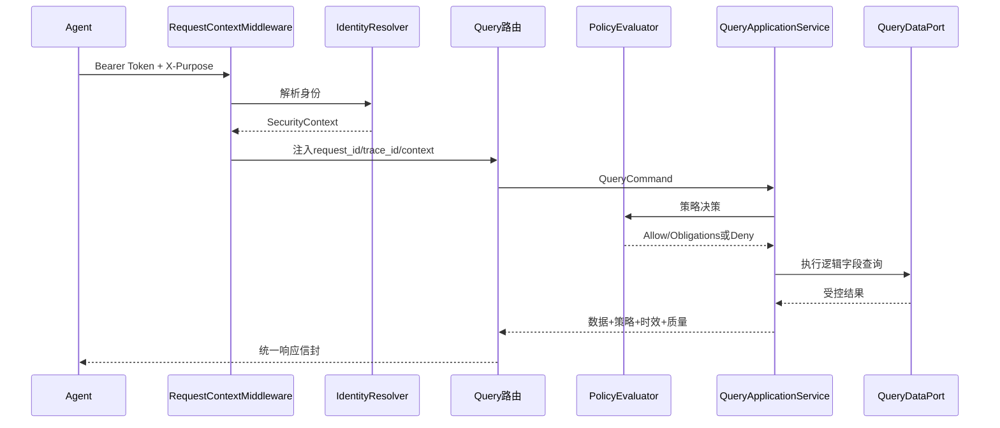
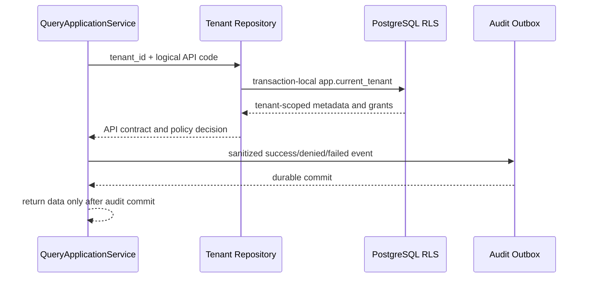

# V1.0代码架构说明

## 首个纵向切片

## 安全边界

- API路由不读取请求中的tenant_id，租户由身份解析器提供。
- 应用服务合并策略行过滤，调用者不能覆盖不可变条件。
- Query定义控制可选字段、过滤操作符、排序字段和最大行数。
- 未注册API、用途不匹配、主体无授权、字段越界均失败关闭。
- 生产环境不允许开发身份解析器。

## 内存适配器说明

当前`InMemoryQueryRepository`与`InMemoryPolicyRepository`用于：

- 先验证领域模型和接口契约。
- 支持自动化测试和本地演示。
- 为PostgreSQL、OPA/策略服务等正式适配器定义稳定端口。

内存适配器不提供持久性、高可用、租户RLS或审计保证，不得用于生产部署。

## 未来替换点

| 当前端口 | 当前实现 | 正式实现 |
|---|---|---|
| `IdentityResolver` | 开发Token解析器 | OIDC/JWT+Identity Service |
| `PolicyRepository` | 内存Grant | PostgreSQL策略库/独立PDP |
| `QueryApiRepository` | 内存API定义 | PostgreSQL Data API目录 |
| `QueryDataPort` | 内存行集合 | 只读Serving PostgreSQL |
| 审计 | 后续接口预留 | Outbox+Kafka+WORM |

## Iteration 2 持久化与审计边界

生产持久化由 Alembic 管理。应用账号不得拥有 `BYPASSRLS`；Repository 的显式租户条件用于纵深防御和测试可验证性。Outbox 当前是审计的可靠写入边界，Kafka Relay 与 WORM 归档在后续迭代实现。
