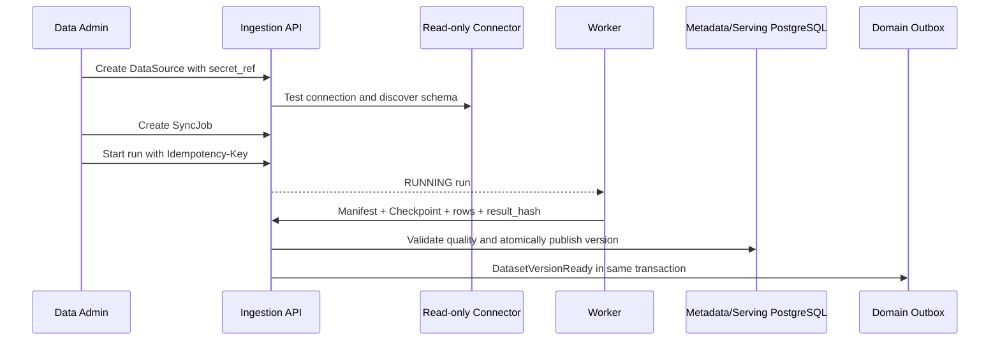

# Iteration 3 结构化数据接入与 Serving 设计

## 交付边界

本迭代提供 PostgreSQL 数据源接入的可运行控制面和数据提交面。MySQL、Oracle 连接器类型保留在 API 契约中，但服务端在对应驱动、方言测试与安全验收完成前返回 `INVALID_ARGUMENT`，不得以未经验证的通用连接替代。

| 能力 | Iteration 3 状态 | 生产依赖 |
|---|---|---|
| 数据源注册 | 已实现 | PostgreSQL元数据库 |
| Secret处理 | 仅保存Secret引用 | 企业Vault/KMS适配器 |
| 连接测试与Schema发现 | PostgreSQL适配器已实现 | 只读账号、网络白名单 |
| 同步任务与运行 | 状态机和接口已实现 | 后续Airflow/Worker调度器 |
| Worker结果提交 | 已实现幂等回调 | mTLS服务身份 |
| DatasetVersion发布 | 已实现事务与质量门禁 | PostgreSQL |
| Serving查询 | 已实现当前发布版本只读适配器 | 独立Serving PostgreSQL实例 |
| Outbox Relay | 已实现租户级Relay | Kafka Publisher适配器 |

## 接入流程

## 安全约束

- 数据源配置只允许 Host、Port、Database、TLS 和网络区等非凭据信息。
- Secret 必须使用 `vault://`、`aws-secretsmanager://` 或 `azure-keyvault://` 引用；API 不返回引用原文。
- 生产连接器通过 `SecretResolver` 注入企业密钥系统，默认实现拒绝访问。
- Agent 主体没有接入管理权限；管理接口要求 USER scope，回调要求 SERVICE scope。
- Worker 回调的 Tenant 来自可信服务身份，不接受 Body 中的 Tenant。
- 每个 Repository 查询、写入及 Relay 均显式限定 Tenant，并受 PostgreSQL RLS 二次约束。
- 质量门禁不通过的 Run 进入 `QUARANTINED`，不更新 Dataset 当前版本。

## 原子提交

完成回调在单一事务中锁定 IngestionRun 和 Dataset，依次写入 DatasetVersion、Serving Rows、Dataset 活跃版本指针、Run 成功状态及 Domain Outbox。任一操作失败则整体回滚。同一 `run_id + result_hash` 重复回调返回已有结果；不同结果哈希返回冲突。

## Outbox Relay

Relay 按 Tenant 领取 `PENDING` 事件并使用 `FOR UPDATE SKIP LOCKED` 支持并发 Worker，投递语义为至少一次。成功转为 `PUBLISHED`；失败保持 `PENDING` 并指数退避。数据库只记录异常类型的哈希指纹，避免 Broker 错误泄露凭据或 Payload。

Kafka Publisher 是 `EventPublisher` 端口的部署适配器，本仓库测试使用确定性内存 Publisher，不在 API 进程中隐式启动后台线程。

## API

| 方法 | 路径 | 用途 |
|---|---|---|
| POST | `/api/v1/data-sources` | 注册数据源 |
| POST | `/api/v1/data-sources/{id}/test` | 只读连接测试 |
| POST | `/api/v1/data-sources/{id}/discover` | Schema发现 |
| POST | `/api/v1/sync-jobs` | 创建同步任务 |
| POST | `/api/v1/sync-jobs/{id}/runs` | 幂等启动运行 |
| GET | `/api/v1/sync-runs/{id}` | 查询运行状态 |
| POST | `/api/v1/sync-runs/{id}/retry` | 从Checkpoint幂等重试 |
| POST | `/api/v1/sync-runs/{id}/cancel` | 请求取消运行 |
| POST | `/internal/v1/ingestion/runs/{id}/callbacks` | Worker提交结果 |

## 尚未完成

- Airflow DAG、Connector Worker 容器和真实批量抽取。
- Vault/AWS Secrets Manager/Azure Key Vault 产品适配器。
- Kafka Producer 配置、Schema Registry 与 WORM 审计归档。
- 大规模 Serving JSON 字段下推、游标分页和分区治理。
- MySQL与Oracle生产连接器认证。
