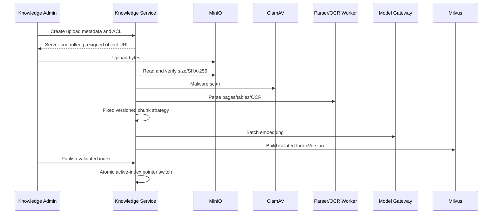

# Iteration 4 安全知识处理与检索设计

## 交付范围

Iteration 4 提供从安全文件登记到 Agent Knowledge API 的完整纵向切片。平台控制文件对象路径、解析与切块版本、Embedding 模型版本、向量索引版本、ACL、引用、模型出站和审计；Agent 不能指定 Bucket、Collection、Embedding 模型、系统 Prompt 或 ACL 过滤条件。

## 处理流程



## 检索安全流水线

```text
Trusted identity + purpose
  -> Published KnowledgeBase contract
  -> query Prompt Injection guard
  -> fixed Embedding deployment
  -> Milvus tenant/kb/index/ACL pre-filter
  -> PostgreSQL current Document ACL and status recheck
  -> retrieved-content injection filter
  -> classification-based model egress decision
  -> evidence, citation and sanitized audit event
```

向量过滤只负责缩小候选范围，不作为最终授权依据。返回前必须读取当前文档状态和 ACL，因而撤销权限无需重建向量索引即可生效。

## 数据保护

- 对象路径由服务端根据 Tenant、KnowledgeBase、DocumentVersion 和 SHA-256 生成。
- Chunk 正文进入 PostgreSQL 前通过 Tenant 内容密钥加密；生产环境缺少 `ContentCipher` 时失败关闭。
- Milvus 只保存向量、Chunk ID、Tenant、IndexVersion 和 ACL Token，不保存正文。
- `CONFIDENTIAL` 和 `SECRET` 证据禁止发送到外部生成模型，可降级为仅返回证据。
- 审计事件只保存索引版本、候选数、授权数、返回数和生成状态，不保存查询或证据正文。
- Knowledge API 返回 `Cache-Control: no-store`。

## 蓝绿索引

新文档处理会以知识库完整 Chunk 集合构建新的 `READY` IndexVersion。发布事务锁定 KnowledgeBase 与目标版本，退休旧 `PUBLISHED` 版本并切换 `active_index_version_id`。在线检索始终绑定一个不可变的已发布版本。

DocumentVersion 保存已构建的 IndexVersion ID，Worker 重复回调直接返回已有版本，避免重复 Chunk、重复 Embedding 和重复索引。

## 生产适配器

| 端口 | 已交付适配器 | 配置要求 |
|---|---|---|
| ObjectStorage | `MinioObjectStorage` | 注入启用TLS与对象锁的MinIO Client |
| FileSecurityScanner | `ClamAvFileSecurityScanner` | 注入ClamAV Client，异常失败关闭 |
| DocumentParser | `CompositeDocumentParser` | 按MIME注入PDF、Office和OCR解析器 |
| EmbeddingPort | `HttpEmbeddingGateway` | 固定内部Model Gateway部署 |
| VectorIndexPort | `MilvusVectorIndex` | 固定Collection，强制Tenant/ACL过滤 |
| GenerationPort | `DeepSeekGenerationGateway` | Secret注入API Key，固定模型与温度 |
| ContentCipher | 企业KMS实现 | Tenant级密钥与轮换策略 |

开发环境使用确定性 Embedding、内存向量和 UTF-8 文本解析器，仅用于测试，不会在 production 自动启用。

## API

| 方法 | 路径 | 用途 |
|---|---|---|
| POST | `/api/v1/knowledge-bases` | 创建知识库与发布契约 |
| POST | `/api/v1/files/uploads` | 创建安全上传会话 |
| POST | `/internal/v1/knowledge/document-versions/{id}/process` | Worker处理文档版本 |
| POST | `/api/v1/knowledge-bases/{kb_id}/indexes/{index_id}/publish` | 发布蓝绿索引 |
| POST | `/agent-data/v1/knowledge/{api_code}` | Agent授权检索与生成 |

## 后续生产化事项

- PDF、Word、Excel版面解析与OCR引擎选型和沙箱部署。
- Milvus Collection Schema、分区、压测与备份恢复。
- 企业KMS Envelope Encryption、密钥轮换和历史密文迁移。
- DeepSeek Token/成本计量、限额、熔断和多模型路由。
- 检索评测集、重排模型和知识库发布审批工作流。
